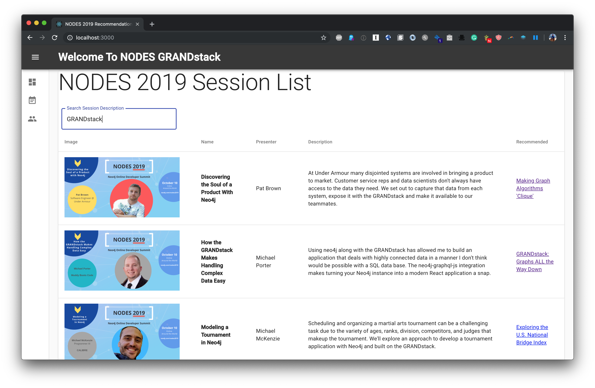
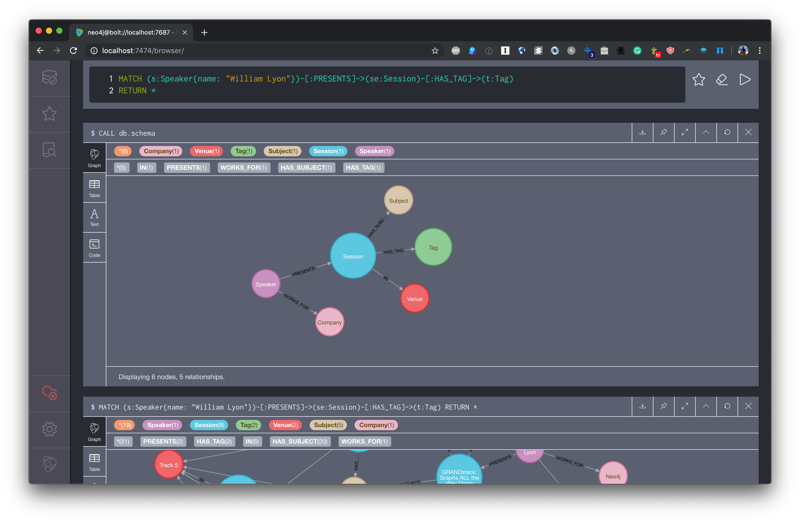
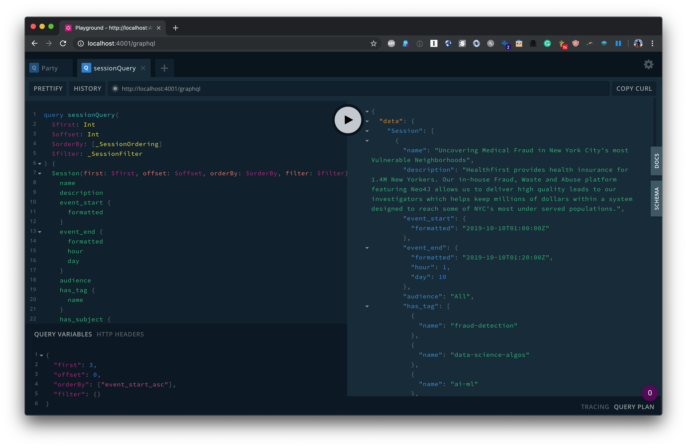

[](https://deploy.now.sh/?repo=https://github.com/johnymontana/NODES2019-GRANDstack&env=NEO4J_USER&env=NEO4J_URI&env=NEO4J_PASSWORD)

# NODES 2019 GRANDstack Conference Search App



The [Neo4j Online Developer Expo and Summit (NODES) 2019](https://neo4j.com/online-summit/) is an online developer focused conference celebrating graph technology, such as graph databases, graph algorithms, GraphQL, and [GRANDstack.](https://grandstack.io) This repo contains a simple demo GRANDstack app to explore the conference sessions and show personalized recommendations using:

**GRANDstack**

* GraphQL
* React
* Apollo
* Neo4j Database

## Neo4j



The data for the app is stored in Neo4j graph database. You can download Neo4j locally or spin up a Neo4j Sandbox. Be sure APOC is installed, then run this Cypher load script to import the dataset:

```Cypher
LOAD CSV WITH HEADERS FROM "https://neo4j-datasets-public.s3-us-west-2.amazonaws.com/nodes2019.csv" AS row 
WITH row SKIP 2
MERGE (s:Session {id: coalesce(row.SLUG, "N/A")})
SET s.event_end   = datetime({epochMillis: apoc.date.parse(row.event_end, 'ms', 'MM/dd/yyy HH:mm a')}),
    s.photo       = row.PHOTO,
    s.audience    = row.audience,
    s.event_start = datetime({epochMillis: apoc.date.parse(row.event_start, 'ms', 'MM/dd/yyy HH:mm a')}),
    s.name        = row.name,
    s.description = row.description
MERGE (v:Venue {name: coalesce(row.venue, "N/A")})
MERGE (s)-[:IN]->(v)

MERGE (cp:Company {name: coalesce(row.company, "N/A")})

WITH *

FOREACH(spk IN split(row.speakers, ";") |
  MERGE (sp:Speaker {name: coalesce(trim(spk), "N/A")})
  MERGE (sp)-[:WORKS_FOR]->(cp)
  MERGE (sp)-[:PRESENTS]->(s)
)

FOREACH(subj IN split(row.subject,",") |
  MERGE (sub:Subject {name: coalesce(subj, "N/A")})
  MERGE (s)-[:HAS_SUBJECT]->(sub)
)

FOREACH(tg IN split(row.sessionTags, ",") |
  MERGE (t:Tag {name: tg})
  MERGE (s)-[:HAS_TAG]->(t)
)
```

## GraphQL API



A GraphQL API fetches data from Neo4j using the [`neo4j-graphql.js`](https://grandstack.io/docs/neo4j-graphql-js.html)

*Install dependencies*

```
(cd ./api && npm install)
```

*Start API server*
```
cd ./api && npm start
```

## React UI

The React app uses Apollo Client to query the GraphQL API and render search results and recommendations.

*Start UI server*
```
cd ./ui && npm install 
npm start
```

## Deployment

### Zeit Now v2

Zeit Now v2 can be used with monorepos such as grand-stack-starter. [`now.json`](https://github.com/grand-stack/grand-stack-starter/blob/master/now.json) defines the configuration for deploying with Zeit Now v2.

1. Set the now secrets for your Neo4j instance:

```
now secret add NEO4J_URI bolt+routing://<YOUR_NEO4J_INSTANCE_HERE>
now secret add NEO4J_USER <YOUR_DATABASE_USERNAME_HERE>
now secret add NEO4J_PASSWORD <YOUR_DATABASE_USER_PASSWORD_HERE>
```

2. Run `now`

### Zeit Now v1

1. Run `now` in `/api` and choose `package.json` when prompted.
1. Set `REACT_APP_GRAPHQL_API` based on the API deployment URL from step 1 in `ui/.env`
1. Run `now` in `/env` and choose `package.json` when prompted.